<div align="center">

# 🛡️ CyberSentinel AI

**Real-Time Network Intrusion Detection & AI-Powered SOC Dashboard**

[](https://www.python.org/)
[](https://react.dev/)
[](https://fastapi.tiangolo.com/)
[](https://streamlit.io/)
[](https://scikit-learn.org/)
[](https://xgboost.readthedocs.io/)
[](https://vitejs.dev/)
[](LICENSE)
[](#)

</div>

---

## TL;DR

* **What it is**: A full-stack, end-to-end Network Intrusion Detection System (NIDS) that trains 5 ML architectures concurrently, auto-selects the best performer, and explains every blocked packet in plain English.
* **Who it's for**: Security Analysts, Threat Hunters, SOC teams, and ML/Data Science engineers evaluating cybersecurity models.
* **Why it matters**: Traditional NIDS are black boxes. CyberSentinel pairs real-time detection with Explainable AI (XAI), so analysts see *exactly* which TCP anomaly or timing irregularity triggered an alert—not just a label.

---

## Demo


###Data set download
https://www.kaggle.com/datasets/h2020simargl/simargl2021-network-intrusion-detection-dataset?resource=download


https://drive.google.com/file/d/1gnCsBd0WMz2MyEXns71qLodzDs0Un9x0/view

---

## Why This Exists

Enterprise networks generate petabytes of traffic daily. Manual threat triage is impossible at scale. While ML models can flag anomalies, they routinely fail to explain *why* a packet was blocked, causing alert fatigue and disruptive false positives.

**CyberSentinel solves three problems simultaneously:**

| Problem | Impact | How CyberSentinel Fixes It |
| :--- | :--- | :--- |
| Black-box ML detections | Analysts can't trust or act on unexplained alerts | XAI engine generates per-packet English explanations |
| Single-model fragility | One model may overfit or miss novel attack vectors | Concurrent 5-model benchmark with dynamic F1-based auto-promotion |
| Cloud memory limits for large datasets | 10GB+ CSV datasets crash free-tier cloud platforms instantly | Local `data_server.py` streams chunked, downcast data via Ngrok tunnel |

---

## Features

### Core ML Engine

* **5 Model Architectures**: Random Forest, Decision Tree, Gaussian Naïve Bayes, XGBoost, and Multi-Layer Perceptron (MLP) — all trained and evaluated concurrently.
* **Auto-Selection**: The model with the highest **Weighted F1-Score** is automatically promoted to handle all live `/api/predict` traffic.
* **6 Evaluation Metrics**: Accuracy, Precision, Recall (critical — a missed attack is catastrophic), F1-Score, ROC-AUC, and Confusion Matrix.
* **Explainable AI (XAI)**: Feature-importance extraction + intelligent category detection (timing, TCP, protocol, size) generates human-readable narratives like *"Flagged due to anomalous TCP window scaling consistent with SYN flood behavior."*
* **Responsible AI Notices**: Built-in warnings about model limitations, false positives/negatives, and the need for human oversight.

### Data Engineering

* **3-Tier Data Loading Priority**:
  1. Local CSV files on the server filesystem (development / if files are present)
  2. Remote laptop data server via `DATA_SOURCE_URL` (cloud training on large datasets)
  3. Synthetic data generation with realistic attack distributions (60% Normal, 15% DoS, 10% DDoS, 10% Reconnaissance, 5% Theft) as a zero-config fallback.
* **15 Selected TCP/IP Feature Vectors**: `DST_TOS`, `SRC_TOS`, `TCP_WIN_SCALE_OUT`, `TCP_WIN_SCALE_IN`, `TCP_FLAGS`, `TCP_WIN_MAX_OUT`, `PROTOCOL`, `TCP_WIN_MIN_OUT`, `TCP_WIN_MIN_IN`, `TCP_WIN_MAX_IN`, `LAST_SWITCHED`, `TCP_WIN_MSS_IN`, `TOTAL_FLOWS_EXP`, `FIRST_SWITCHED`, `FLOW_DURATION_MILLISECONDS`.
* **Memory-Safe Processing**: `float64 → float32`, `int64 → int32` downcasting, `SimpleImputer` for NaN handling, `StandardScaler` normalization.
* **Global DataFrame Caching**: Prevents redundant re-downloads during sequential multi-model training runs.

### Dual Frontend Experience

* **React + Vite Dashboard** (C-Suite / Display Screens): Fast, reactive polling with TailwindCSS, Framer Motion animations, Recharts live telemetry, and `react-simple-maps` geo-visualization.
* **Streamlit SOC Console** (Analysts / Data Scientists): 841-line analytical dashboard with 5 tabs — Overview, Real-Time Ops, Model Comparison, Intelligence (XAI), and Resource Monitor.

### Security & Reliability

* **Bearer Token Authorization** on the local data server to prevent public scraping.
* **Thread-Safety Fixes**: Explicit `OMP_NUM_THREADS=1` environment locks to prevent OpenMP/BLAS deadlocks on Windows + scikit-learn.
* **Graceful Fallbacks**: No dataset? The system auto-generates synthetic data and continues operating.

---

## Architecture (High Level)

### System Architecture

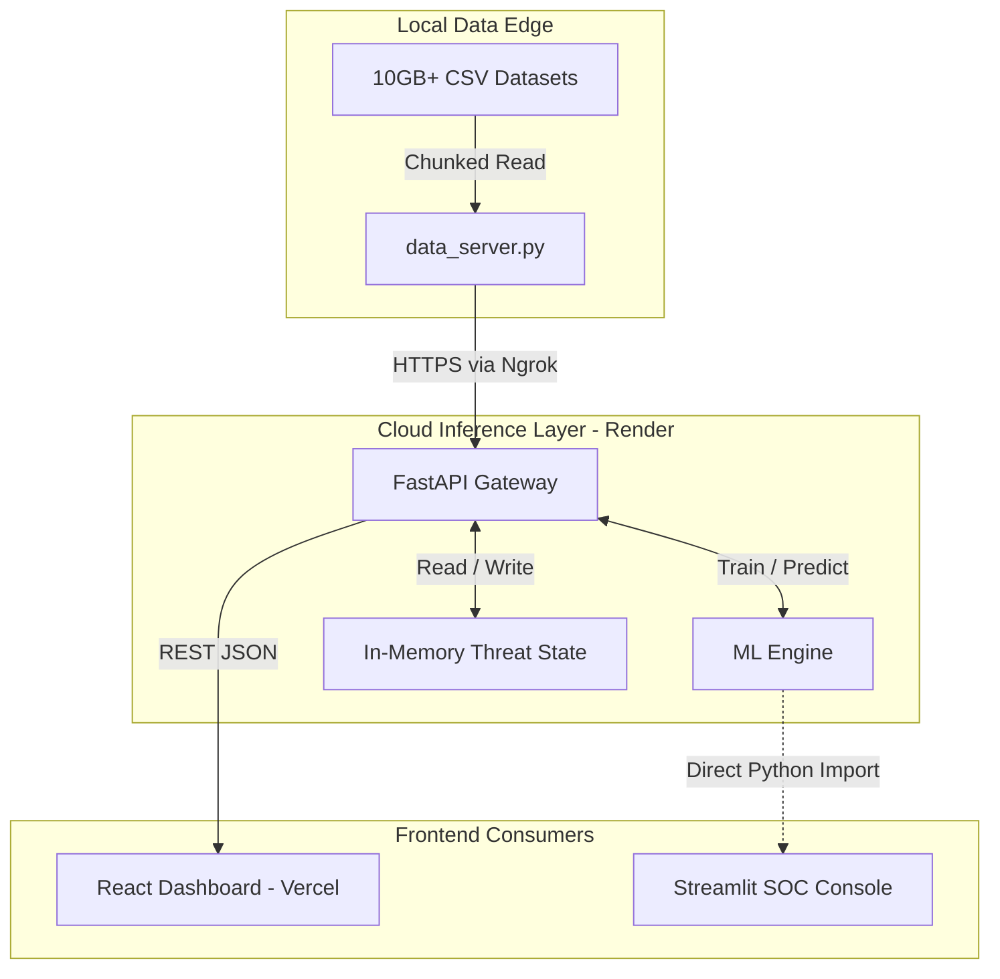

### ML Training Pipeline Flowchart

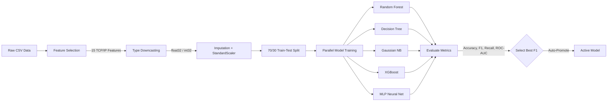

### Real-Time Inference Request Lifecycle

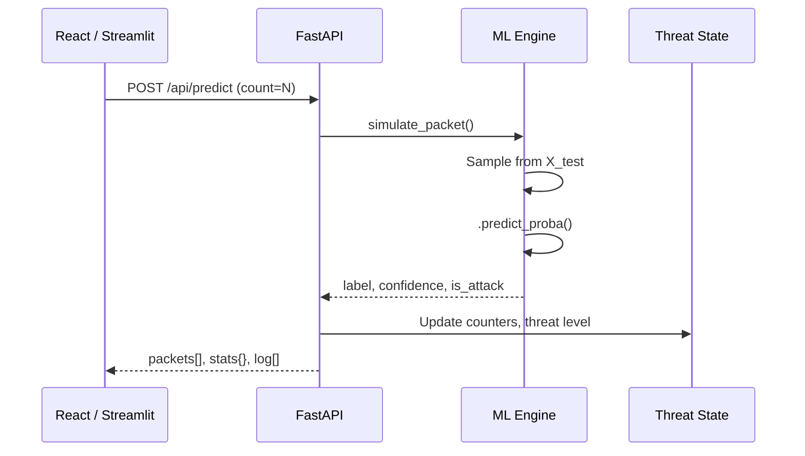

---

## Model Architectures & Hyperparameters

| Model | Key Hyperparameters | Strengths | Latency |
| :--- | :--- | :--- | :--- |
| **Random Forest** | `n_estimators=50`, `n_jobs=-1`, `random_state=42` | High resistance to overfitting; robust feature importance | ~1–3ms per batch |
| **Decision Tree** | `criterion=gini`, `random_state=42` | Ultra-fast inference; fully transparent branching | <0.5ms |
| **Gaussian NB** | — (no tunable params) | Extremely lightweight; fast anomaly detection | <0.1ms |
| **XGBoost** | `n_estimators=50`, `learning_rate=0.1`, `max_depth=3`, `eval_metric=logloss` | Handles massive class imbalances via gradient penalization | ~1–5ms |
| **MLP** | `hidden_layer_sizes=(100,)`, `activation=relu`, `max_iter=200` | Captures nonlinear relationships across OSI layers | ~2–8ms |

### Evaluation Metrics Collected

Every model is scored against all six metrics after training:

| Metric | Why It Matters |
| :--- | :--- |
| **Accuracy** | Overall correctness of classification |
| **Precision** | Of all packets flagged as attacks, how many actually were? |
| **Recall** | Of all actual attacks, how many did the model catch? (Critical for NIDS — missed attacks are catastrophic) |
| **F1-Score (Weighted)** | Harmonic mean of Precision and Recall; the definitive ranking metric due to heavy class imbalance |
| **ROC-AUC** | Multi-class One-vs-Rest area under the curve; measures separability |
| **Confusion Matrix** | Per-class true/false positive/negative breakdown |

---

## Tech Stack

| Layer | Technology | Purpose |
| :--- | :--- | :--- |
| **ML Engine** | Scikit-Learn, XGBoost | Model training, inference, evaluation |
| **Data Processing** | Pandas, NumPy, SimpleImputer, StandardScaler | Feature engineering, imputation, normalization |
| **API Layer** | FastAPI, Uvicorn, Pydantic | Asynchronous REST endpoints with auto-generated Swagger docs |
| **React Frontend** | React 18, Vite, TailwindCSS 4 | Modern reactive dashboard with HMR |
| **Animations** | Framer Motion | Fluid DOM transitions and micro-animations |
| **Charts (React)** | Recharts, react-simple-maps | Real-time SVG charting and geo-threat visualization |
| **Analyst Frontend** | Streamlit 1.25+ | Rapid prototyping state-based Python UI |
| **Charts (Streamlit)** | Plotly 5.15+ | Interactive analytical charts, confusion matrices, ROC curves |
| **XAI** | SHAP 0.42+, Feature Importances | Game-theoretic explainability engine |
| **System Monitoring** | psutil | Live RAM/CPU usage tracking |
| **Model Persistence** | joblib | Serialized model artifact storage |
| **Infra** | Render, Vercel, Ngrok | Cloud hosting + secure local data tunneling |

---

## Project Structure

```text
CyberSentinel-AI/
│
├── IntrusionDetectionDashboard/          # Standalone Streamlit SOC UI
│   ├── app.py                            # Main 841-line analytical dashboard (5 tabs)
│   ├── config.py                         # Paths, thresholds, UI theme constants
│   ├── Dockerfile                        # Container deployment config
│   ├── requirements.txt                  # Python dependencies
│   ├── assets/                           # Custom CSS styles
│   ├── models/                           # Serialized .joblib model artifacts (50+ files)
│   ├── logs/                             # Structured application logs
│   └── utils/                            # Modular helper library
│       ├── preprocessing.py              # Data loading, cleaning, feature engineering
│       ├── training.py                   # Model instantiation and fitting
│       ├── evaluation.py                 # Metrics computation, confusion matrix, ROC curves
│       ├── explainability.py             # SHAP value computation and summary plots
│       ├── model_io.py                   # joblib save/load/list operations
│       └── logger.py                     # Structured logging setup
│
├── cyber-dashboard/                      # React + FastAPI full-stack application
│   ├── src/                              # React component tree
│   │   ├── App.jsx                       # Root application with tab routing
│   │   ├── api.js                        # FastAPI endpoint client wrapper
│   │   ├── index.css                     # Global styles and design tokens
│   │   ├── main.jsx                      # React DOM entry point
│   │   └── components/                   # 14 reusable UI components
│   ├── index.html                        # SPA entry point
│   ├── vite.config.js                    # Vite build configuration
│   ├── package.json                      # Node.js dependencies and scripts
│   └── backend/                          # Python REST inference engine
│       ├── server.py                     # FastAPI app, routes, in-memory state (345 lines)
│       ├── requirements.txt              # Backend Python dependencies
│       └── ml/                           # Core ML logic
│           ├── data.py                   # 3-tier data loading, preprocessing, caching
│           └── engine.py                 # Model creation, training, evaluation, simulation
│
├── data_server.py                        # Local HTTP streaming server for large CSVs
├── train_model.py                        # Standalone CLI model trainer
├── .gitignore                            # Git exclusion rules
└── README.md                             # This file
```

---

## Quickstart

You can have the entire system running locally in under 5 minutes.

```bash
# Clone the repository
git clone https://github.com/SoubhagyaJain/CyberSentinel-AI.git
cd CyberSentinel-AI
```

**Option A — Full Stack (React + FastAPI)**
```bash
# Terminal 1: Backend
cd cyber-dashboard/backend
python -m venv venv && source venv/bin/activate  # Windows: venv\Scripts\activate
pip install -r requirements.txt
uvicorn server:app --host 0.0.0.0 --port 8000 --reload

# Terminal 2: Frontend
cd cyber-dashboard
npm install
echo "VITE_API_URL=http://localhost:8000" > .env.development
npm run dev
```

**Option B — Streamlit SOC Console (standalone)**
```bash
cd IntrusionDetectionDashboard
python -m venv .venv && source .venv/bin/activate
pip install -r requirements.txt
streamlit run app.py
```

> **Note**: If no `dataset-partX.csv` files are present, the system automatically generates synthetic data with realistic attack distributions and continues operating.

---

## Installation

### Requirements

* Python `3.10+`
* Node.js `18+` (only for React frontend)
* 8GB+ RAM recommended (16GB for full 500k sample training)

### Backend Setup

```bash
cd cyber-dashboard/backend
python -m venv venv
source venv/bin/activate  # Windows: venv\Scripts\activate
pip install -r requirements.txt
```

### React Frontend Setup

```bash
cd cyber-dashboard
npm install
echo "VITE_API_URL=http://localhost:8000" > .env.development
```

### Streamlit Setup

```bash
cd IntrusionDetectionDashboard
python -m venv .venv
source .venv/bin/activate
pip install -r requirements.txt
```

---

## Configuration

| Variable | Where | Description | Default |
| :--- | :--- | :--- | :--- |
| `DATA_SOURCE_URL` | Backend env | Ngrok URL pointing to your local `data_server.py` | *(none)* |
| `DATA_SECRET` | Backend env + `data_server.py` | Bearer token for data stream authentication | `cybersentinel-local-2024` |
| `VITE_API_URL` | React `.env` | Base URL for the FastAPI backend | `http://localhost:8000` |
| `SAMPLE_SIZE` | `config.py` | Default sample size for interactive training | `100000` |
| `MAX_SAMPLE_SIZE` | `config.py` | Maximum allowed sample size in web interface | `500000` |
| `SHAP_SAMPLE_SIZE` | `config.py` | Number of samples for SHAP computation (expensive) | `100` |
| `RAM_WARNING_THRESHOLD` | `config.py` | RAM usage percentage to trigger UI warning | `80` |
| `TEST_SIZE` | `config.py` | Train/test split ratio | `0.3` |
| `RANDOM_STATE` | `config.py` / `engine.py` | Seed for reproducibility across all models | `42` |

---

## Usage

### Start the Local Data Server

Run from the repository root (only needed if you have the large CSV datasets):
```bash
python data_server.py
# Optionally expose to the internet:
ngrok http 7860
```

### Start the FastAPI Backend

Run from `cyber-dashboard/backend`:
```bash
uvicorn server:app --host 0.0.0.0 --port 8000 --reload
```
API Documentation: `http://localhost:8000/docs`

### Start the React Dashboard

Run from `cyber-dashboard`:
```bash
npm run dev
```
Dashboard live at `http://localhost:5173`

### Train Models via API

```bash
# Train all 5 models with 100k samples
curl -X POST http://localhost:8000/api/train \
  -H "Content-Type: application/json" \
  -d '{"sample_size": 100000}'

# Train a specific model
curl -X POST http://localhost:8000/api/train \
  -H "Content-Type: application/json" \
  -d '{"model_name": "XGBoost", "sample_size": 100000}'
```

### Run Predictions

```bash
# Simulate 10 packet predictions
curl -X POST http://localhost:8000/api/predict \
  -H "Content-Type: application/json" \
  -d '{"count": 10}'
```

### Switch Active Model

```bash
curl -X POST http://localhost:8000/api/set-active/XGBoost
```

---

## API Reference

| Method | Endpoint | Description |
| :--- | :--- | :--- |
| `GET` | `/api/health` | Liveness probe. Returns status and loaded model count. |
| `POST` | `/api/train` | Trains one or all models. Body: `{ model_name?, sample_size }`. |
| `GET` | `/api/models` | Returns model registry with metrics, feature importance, and active model. |
| `POST` | `/api/set-active/{model_name}` | Overrides the auto-selected active model. Resets simulation. |
| `POST` | `/api/predict` | Simulates N packet predictions through the active model. Body: `{ count }`. |
| `GET` | `/api/dashboard` | Aggregated stats: packets, blocked, threat level, attack distribution, model info. |
| `GET` | `/api/system` | Live system metrics: RAM %, CPU %, used/total GB. |
| `POST` | `/api/simulation/reset` | Resets all simulation counters and threat state. |
| `POST` | `/api/models/reset` | Clears all trained models and resets to blank state. |

---

## Streamlit Dashboard Tabs

The Streamlit SOC Console (`app.py`, 841 lines) provides 5 operational tabs:

| Tab | Purpose |
| :--- | :--- |
| **📊 Overview** | Traffic class distribution (pie chart), dataset preview, active model performance snapshot (accuracy, F1, ROC-AUC, train time). |
| **🚨 Real-Time Ops** | Live packet stream with color-coded severity (`⛔ Attack` / `✅ Normal`), start/stop/reset simulation controls, threat level indicator, session metrics. |
| **📈 Model Comparison** | Side-by-side performance summary table with highlighted best scores. Bar charts for Accuracy, F1, ROC-AUC, and Training Time. Per-model confusion matrix viewer. |
| **🧠 Intelligence (XAI)** | Global feature importance chart, auto-generated model behavior analysis, per-packet local explanations with reasoning strings and confidence gauges, responsible AI warnings. |
| **🖥️ Resources** | Live RAM usage gauge with progress bar, CPU utilization monitor. |

---

## Deployment

### FastAPI Backend → Render

1. Connect your repository. Root directory: `cyber-dashboard/backend`.
2. Build command: `pip install -r requirements.txt`
3. Start command: `uvicorn server:app --host 0.0.0.0 --port $PORT`
4. Set environment variables: `DATA_SOURCE_URL`, `DATA_SECRET`.

### React Frontend → Vercel

1. Connect your repository. Framework: Vite. Root directory: `cyber-dashboard`.
2. Set environment variable: `VITE_API_URL` → your Render backend URL.

### Streamlit → Render / Streamlit Cloud

1. Root directory: `IntrusionDetectionDashboard`.
2. Start command: `streamlit run app.py --server.port $PORT`

### Local Data Edge (Large Datasets)

1. Place `dataset-partX.csv` files in the repo root.
2. Run `python data_server.py` on your laptop.
3. Expose: `ngrok http 7860`. Copy the HTTPS URL to your Render `DATA_SOURCE_URL` env var.

---

## Security

* **Data Authorization**: `data_server.py` validates a `Bearer` token on every request. Always change the default `DATA_SECRET` before exposing via Ngrok.
* **CORS**: The FastAPI backend uses `allow_origins=["*"]` for development convenience. Restrict this to your Vercel domain in production.
* **State Volatility**: Threat state is held in-memory via `app.state`. It is fast but volatile — a server restart clears all simulation data. This is by design for a demo system.
* **Thread Safety**: Explicit `OMP_NUM_THREADS=1` / `OPENBLAS_NUM_THREADS=1` environment locks are set at import time to prevent OpenMP deadlocks on Windows with scikit-learn.

---

## Troubleshooting

| Issue | Cause | Fix |
| :--- | :--- | :--- |
| `MemoryError` during training | Sample size too large for available RAM | Reduce `sample_size` to `10000`–`50000`. Ensure downcasting is active in `ml/data.py`. |
| API returns 500 on `/api/train` | Data server unreachable or no local CSVs | Ensure `data_server.py` is running + Ngrok is active + `DATA_SOURCE_URL` is correct. The system will fallback to synthetic data if all else fails. |
| Streamlit shows "Model Offline" | No model has been trained yet | Click **⚡ TRAIN ALL MODELS** in the sidebar. |
| React Dashboard shows no data | `VITE_API_URL` misconfigured | Verify the URL matches the running FastAPI instance exactly (no trailing slash). |
| XGBoost model fails to train | `xgboost` package not installed | Run `pip install xgboost`. The system gracefully skips XGBoost if the import fails. |
| SHAP computation is extremely slow | SHAP is computationally expensive | `SHAP_SAMPLE_SIZE` defaults to 100 in `config.py`. Reduce further if needed. |
| scikit-learn hangs on Windows | OpenMP thread deadlock | Already mitigated — `OMP_NUM_THREADS=1` is set at the top of `server.py` and `data.py`. |

---

## Roadmap

* [ ] Real-time PCAP sniffing via `pyshark` / `scapy` to replace CSV-based simulation.
* [ ] Deep sequence models (LSTMs / Transformers) for multi-packet temporal attack detection (Slowloris, low-and-slow probes).
* [ ] PostgreSQL for persistent threat logs + Redis for high-speed rate limiting.
* [ ] Apache Kafka / Celery message queues to decouple ML inference from the API thread.
* [ ] JWT-based Role-Based Access Control (RBAC) — Analyst vs. Admin views.
* [ ] PySpark / Dask distributed training on the full 50GB+ dataset across a cluster.
* [ ] GitHub Actions CI/CD with automated `pytest` and linting.

---

## Contributing

1. Fork the repository.
2. Create a feature branch: `git checkout -b feature/your-feature`
3. Commit your changes: `git commit -m 'feat: add your feature'`
4. Push to the branch: `git push origin feature/your-feature`
5. Open a Pull Request.

Please open an issue before submitting large architectural changes.

---

## License

Distributed under the MIT License. See `LICENSE` for more information.

---

## Assumptions & TODOs

- [x] Dataset files (`dataset-partX.csv`) are manually placed in the root directory.
- [x] Synthetic fallback data is auto-generated if no datasets are available.
- [ ] TODO: Add automated `pytest` test suites for the FastAPI backend.
- [ ] TODO: Add Cypress / Jest tests for the React frontend.
- [ ] TODO: Add GitHub Actions CI/CD pipeline.
- [ ] TODO: Replace demo placeholder with actual GIFs/screenshots.
- [ ] TODO: Restrict CORS origins for production deployment.

---

<div align="center">

<div align="center">

# 🏗️ CyberSentinel AI — Architecture Deep Dive

**A comprehensive architectural reference for the CyberDashboard system**

</div>

---

## Table of Contents

1. [Architecture Overview](#architecture-overview)
2. [System Topology](#system-topology)
3. [Layer-by-Layer Breakdown](#layer-by-layer-breakdown)
   - [Layer 0 — Data Edge](#layer-0--data-edge-local-laptop)
   - [Layer 1 — Data Ingestion & Preprocessing](#layer-1--data-ingestion--preprocessing)
   - [Layer 2 — ML Engine](#layer-2--ml-engine)
   - [Layer 3 — API Gateway](#layer-3--api-gateway-fastapi)
   - [Layer 4A — React Dashboard](#layer-4a--react-dashboard-vite)
   - [Layer 4B — Streamlit SOC Console](#layer-4b--streamlit-soc-console)
4. [Data Flow Architecture](#data-flow-architecture)
5. [State Management Architecture](#state-management-architecture)
6. [ML Training Pipeline Architecture](#ml-training-pipeline-architecture)
7. [Real-Time Inference Architecture](#real-time-inference-architecture)
8. [Explainable AI (XAI) Architecture](#explainable-ai-xai-architecture)
9. [Component Dependency Graph](#component-dependency-graph)
10. [Security Architecture](#security-architecture)
11. [Deployment Architecture](#deployment-architecture)

---

## Architecture Overview

CyberSentinel AI follows a **multi-tier, event-driven architecture** with clear separation of concerns across five distinct layers. The system is designed around a central FastAPI inference server that sits between a flexible data ingestion layer and two independent frontend consumers.

```
┌──────────────────────────────────────────────────────────────────┐
│                        PRESENTATION TIER                         │
│   ┌─────────────────────┐      ┌──────────────────────────────┐  │
│   │  React + Vite (SPA) │      │  Streamlit SOC Console       │  │
│   │  14 Components      │      │  5 Tabs · 841 Lines          │  │
│   │  Context API State  │      │  Session State + Cache        │  │
│   └────────┬────────────┘      └──────────────┬───────────────┘  │
│            │ REST Polling (2s)                 │ Direct Import    │
├────────────┼──────────────────────────────────┼──────────────────┤
│            ▼                                  │                  │
│   ┌────────────────────────────┐              │                  │
│   │  FastAPI Gateway (API)     │◄─────────────┘                  │
│   │  9 REST Endpoints          │        APPLICATION TIER         │
│   │  In-Memory app.state       │                                 │
│   └──────────┬─────────────────┘                                 │
│              │                                                   │
│   ┌──────────▼─────────────────┐                                 │
│   │  ML Engine Layer           │                                 │
│   │  data.py · engine.py       │                                 │
│   │  5 Model Architectures     │                                 │
│   └──────────┬─────────────────┘                                 │
├──────────────┼───────────────────────────────────────────────────┤
│              ▼                          DATA TIER                │
│   ┌────────────────────────────────────────────────────────────┐ │
│   │  3-Tier Data Loading Priority                              │ │
│   │  1. Local CSV  →  2. Remote Laptop Server  →  3. Synthetic │ │
│   └────────────────────────────────────────────────────────────┘ │
└──────────────────────────────────────────────────────────────────┘
```

### Core Architectural Principles

| Principle | Implementation |
| :--- | :--- |
| **Separation of Concerns** | Data loading, ML training, API serving, and presentation are isolated into distinct modules |
| **Graceful Degradation** | 3-tier data fallback ensures the system always operates, even with zero external data |
| **Stateless Inference** | Each `/api/predict` call is stateless; simulation state is accumulated server-side but never required for prediction |
| **Dual-Consumer Pattern** | Two completely independent frontends (React + Streamlit) consume the same ML models, enabling different user personas |
| **Thread Safety by Design** | OpenMP/BLAS thread locks (`OMP_NUM_THREADS=1`) are set at import time, preventing deadlocks before any scikit-learn import |

---

## System Topology

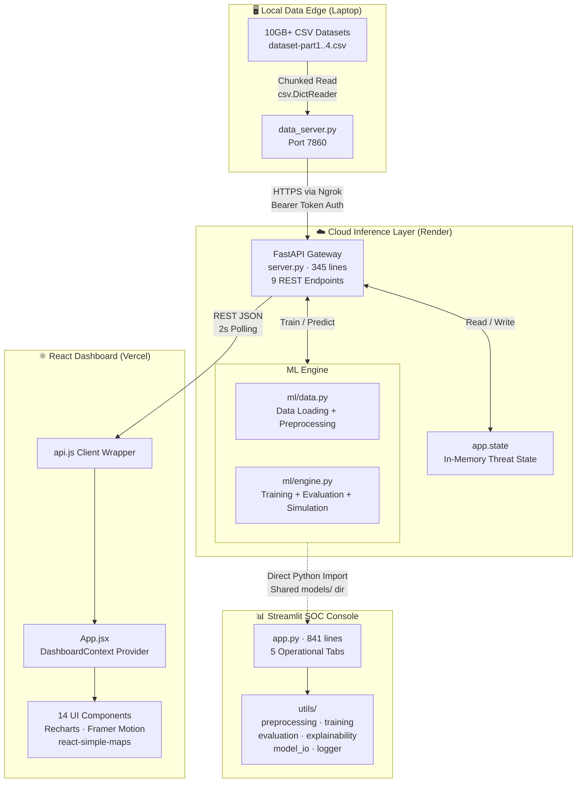

---

## Layer-by-Layer Breakdown

### Layer 0 — Data Edge (Local Laptop)

**File**: `data_server.py` (212 lines)

The Data Edge is a **lightweight HTTP server** that runs on the developer's local machine, serving large CSV datasets to the cloud-hosted backend through an Ngrok tunnel.

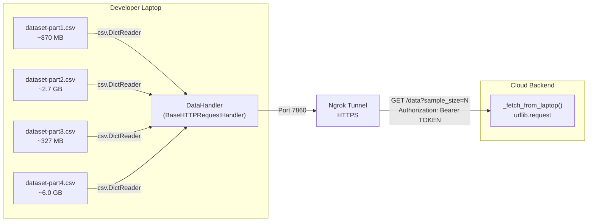

**Architectural Details:**

| Component | Detail |
| :--- | :--- |
| **Server Type** | `http.server.BaseHTTPRequestHandler` (stdlib, zero dependencies) |
| **Endpoints** | `GET /health` (public), `GET /data` (auth required), `GET /info` (auth required) |
| **Auth** | Bearer token validation via `Authorization` header against `DATA_SECRET` env var |
| **Data Strategy** | Interleaved sampling: reads `sample_size / num_files` rows from each CSV, combines via `itertools.chain` |
| **Column Filter** | Only 15 selected TCP/IP features + LABEL are extracted (not full CSV) |
| **Memory Safety** | Streaming via `csv.DictReader` avoids loading entire 10GB+ datasets into RAM |

---

### Layer 1 — Data Ingestion & Preprocessing

**File**: `cyber-dashboard/backend/ml/data.py` (200 lines)

The data layer implements a **3-tier priority loading system** with global caching to prevent redundant downloads during multi-model training.

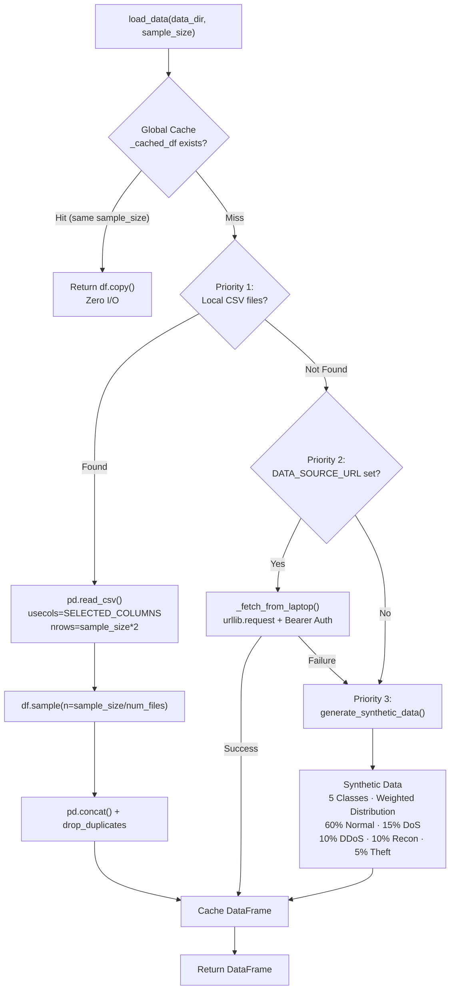

**Preprocessing Pipeline** (`preprocess_data()`):

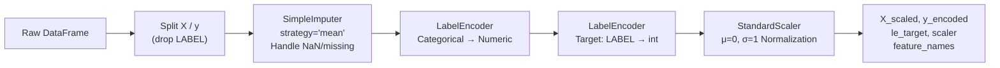

**Feature Vector Architecture:**

The system uses **15 carefully selected TCP/IP features** that span four categories:

| Category | Features | Rationale |
| :--- | :--- | :--- |
| **TCP Window** | `TCP_WIN_SCALE_OUT`, `TCP_WIN_SCALE_IN`, `TCP_WIN_MAX_OUT`, `TCP_WIN_MIN_OUT`, `TCP_WIN_MIN_IN`, `TCP_WIN_MAX_IN`, `TCP_WIN_MSS_IN` | Window scaling anomalies indicate SYN flood, buffer overflow, and resource exhaustion attacks |
| **Protocol Metadata** | `PROTOCOL`, `TCP_FLAGS`, `DST_TOS`, `SRC_TOS` | Protocol violations and abnormal flag combinations (e.g., SYN+FIN) reveal scanning and spoofing |
| **Timing** | `FIRST_SWITCHED`, `LAST_SWITCHED`, `FLOW_DURATION_MILLISECONDS` | Short-duration, high-frequency flows indicate DDoS; long-duration low-traffic flows indicate Slowloris |
| **Flow Statistics** | `TOTAL_FLOWS_EXP` | Exported flow count anomalies signal data exfiltration |

**Memory Optimization:**

```
float64 → float32    (50% memory reduction per float column)
int64   → int32      (50% memory reduction per int column)
Global DataFrame Cache prevents re-download during sequential training
```

---

### Layer 2 — ML Engine

**File**: `cyber-dashboard/backend/ml/engine.py` (144 lines)

The ML Engine is a **stateless, factory-pattern module** that handles model creation, training, evaluation, and real-time packet simulation.

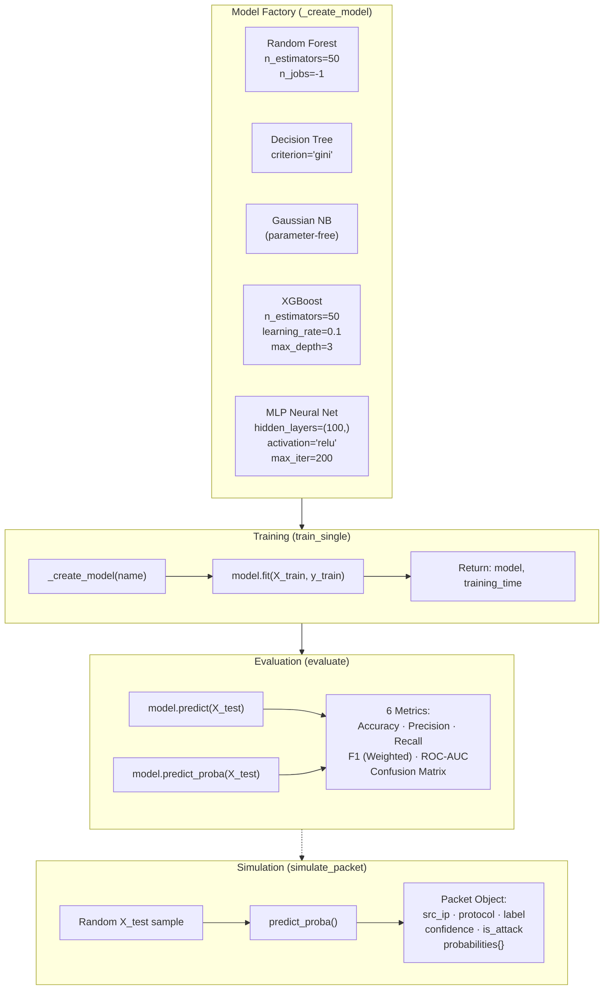

**Model Auto-Selection Algorithm:**

```python
# In server.py — after all models are trained:
best = max(
    app.state.models,
    key=lambda k: app.state.models[k]["metrics"].get("f1", 0)
)
# The model with the highest Weighted F1-Score is auto-promoted
# to handle all live /api/predict traffic
```

The auto-selection uses **Weighted F1-Score** as the ranking metric because:
- **Accuracy** is misleading under class imbalance (60% Normal traffic inflates it)
- **Recall** alone would favor models that flag everything as an attack
- **F1-Score** balances precision and recall; **weighted** variant adjusts for class distribution

---

### Layer 3 — API Gateway (FastAPI)

**File**: `cyber-dashboard/backend/server.py` (345 lines)

The API Gateway is a **FastAPI application** that manages model lifecycle, simulation state, and exposes REST endpoints for both frontends.

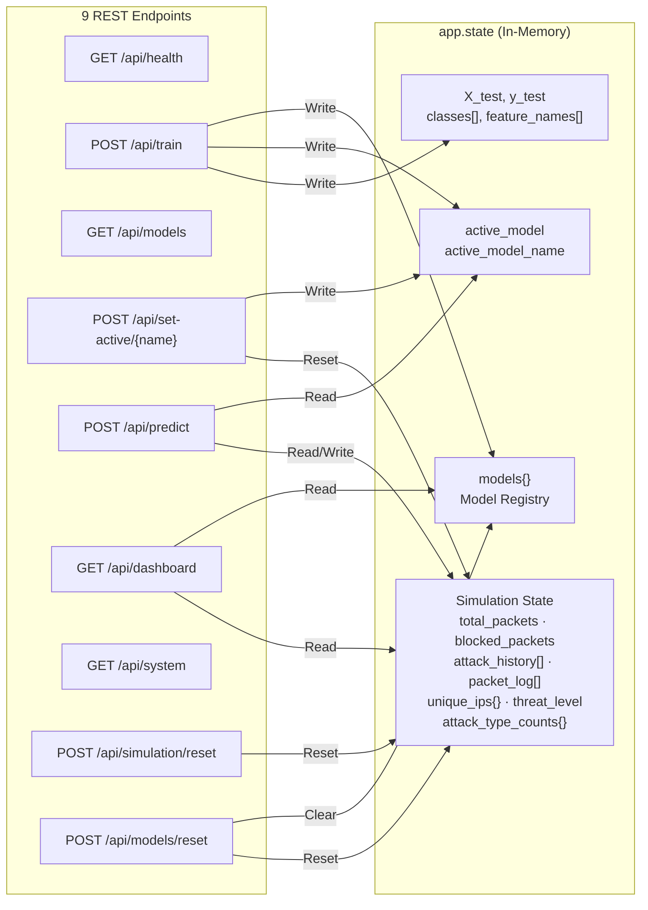

**Endpoint Architecture:**

| Endpoint | Method | Input | Output | Side Effects |
| :--- | :--- | :--- | :--- | :--- |
| `/api/health` | GET | — | `{status, models_loaded}` | None (liveness probe) |
| `/api/train` | POST | `{model_name?, sample_size}` | `{results, classes, active_model, best_model}` | Loads data, trains models, updates registry, resets simulation |
| `/api/models` | GET | — | `{models{}, active_model, classes, feature_names}` | Computes feature importance on-the-fly |
| `/api/set-active/{name}` | POST | Path param | `{active_model}` | Switches active model, resets simulation |
| `/api/predict` | POST | `{count}` | `{packets[], stats{}, log[]}` | Updates all simulation counters |
| `/api/dashboard` | GET | — | Full aggregated state | None (read-only aggregation) |
| `/api/system` | GET | — | `{ram_%, cpu_%, ram_used, ram_total}` | Calls `psutil` (0.1s CPU sampling) |
| `/api/simulation/reset` | POST | — | `{status: "reset"}` | Zeros all simulation counters |
| `/api/models/reset` | POST | — | `{status: "reset"}` | Clears model registry + simulation |

**Middleware:**

```python
CORSMiddleware(allow_origins=["*"])  # Development — restrict in production
```

**Thread Safety:**

```python
# Set at the TOP of server.py, BEFORE any sklearn import
os.environ['OMP_NUM_THREADS'] = '1'
os.environ['OPENBLAS_NUM_THREADS'] = '1'
os.environ['MKL_NUM_THREADS'] = '1'
os.environ['NUMEXPR_NUM_THREADS'] = '1'
```

This prevents the BLAS/OpenMP multi-threading layer from creating parallel threads inside scikit-learn, which causes deadlocks on Windows when combined with FastAPI's async event loop.

---

### Layer 4A — React Dashboard (Vite)

**Directory**: `cyber-dashboard/src/` (14 components)

The React frontend is a **Single Page Application (SPA)** built with Vite, using React Context API for global state and a 2-second polling loop for real-time data.

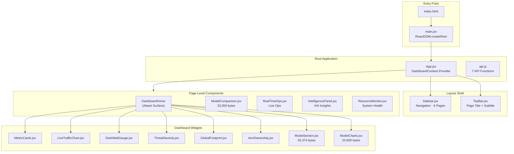

**Client-Side State Flow:**

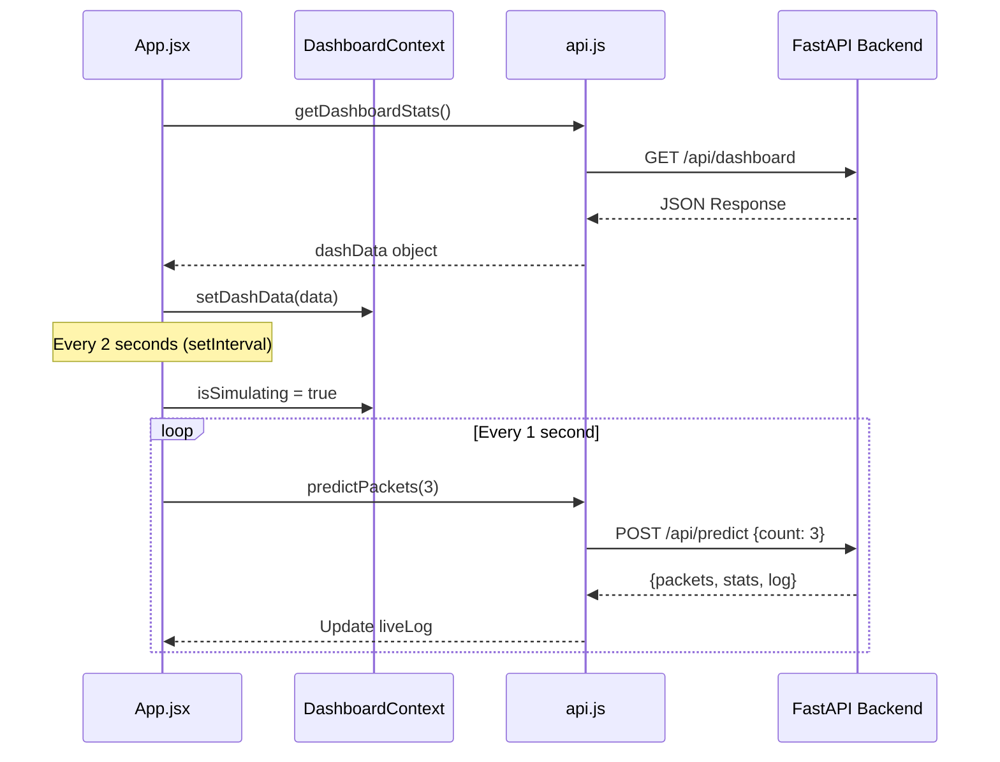

**Page Routing Architecture:**

| Page Key | Component | Description |
| :--- | :--- | :--- |
| `dashboard` / `attack-surface` | `DashboardHome` | 8 widget grid: metrics, live chart, gauge, severity rings, model section, charts, geo-map, ASN |
| `model-comparison` | `ModelComparison` | Side-by-side benchmark of all trained models with bar charts and metrics tables |
| `real-time-ops` | `RealTimeOps` | Live packet stream, start/stop/reset simulation controls, threat level |
| `intelligence` | `IntelligencePanel` | XAI feature importance, model behavior analysis, per-packet explanations |
| `resources` | `ResourceMonitor` | Live RAM/CPU gauges via `/api/system` |

---

### Layer 4B — Streamlit SOC Console

**Directory**: `IntrusionDetectionDashboard/` (841-line `app.py` + 6 utility modules)

The Streamlit dashboard is a **standalone Python application** designed for Security Analysts and Data Scientists. Unlike the React dashboard, it **directly imports** the ML libraries and can perform training, evaluation, and SHAP explainability in the same process.

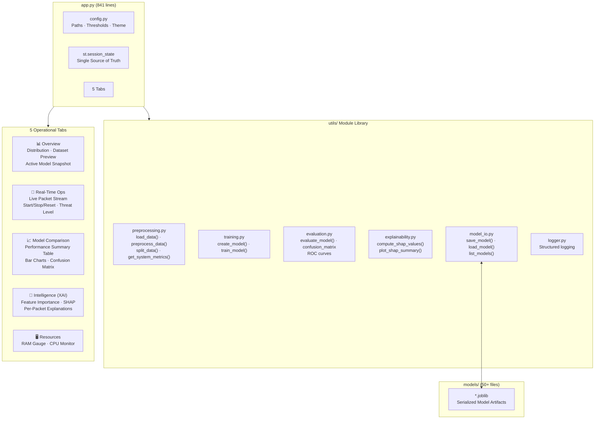

**Streamlit Session State Architecture:**

```python
# Single Source of Truth — initialized once via init_state()
st.session_state = {
    'model': None,                    # Active sklearn model object
    'model_registry': {},             # {name: {model, accuracy, f1, ...}}
    'active_model_name': 'None',      # String identifier
    'classes': [],                    # LabelEncoder classes
    'feature_names': [],              # Column names for XAI
    'test_data': (None, None),        # (X_test, y_test) tuple
    'simulation_running': False,      # Simulation toggle
    'total_packets': 0,               # Packet counter
    'blocked_packets': 0,             # Attack counter
    'packet_log': [],                 # Recent packet history
    'attack_history': [],             # Rolling window for threat level
    'threat_level': 'LOW',            # Computed threat level
}
```

---

## Data Flow Architecture

The complete data flow from raw CSV to rendered UI pixel:

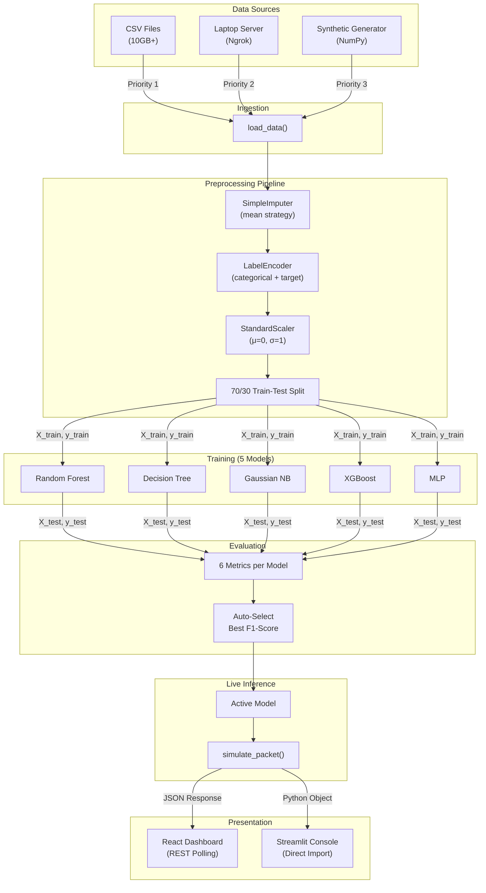

---

## State Management Architecture

The system uses **two distinct state management patterns** for its two frontends:

### FastAPI Backend State (`app.state`)

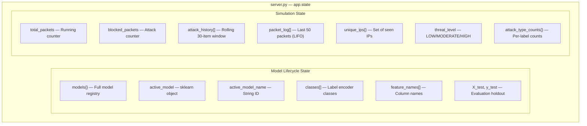

> **Key Design Decision:** All state is held in-memory via `app.state`. This is intentionally volatile — a server restart wipes all simulation data. This is acceptable because:
> - Training can be re-triggered via `/api/train`
> - The system is a real-time simulation, not a persistent audit log
> - In-memory state provides sub-millisecond read/write latency

### React Frontend State

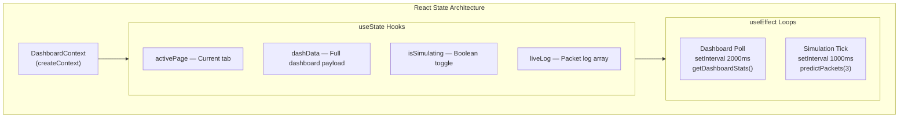

### Streamlit Session State

The Streamlit frontend uses `st.session_state` as a **global mutable dictionary**, with `@st.cache_data` decorators on `load_data()` and `preprocess_data()` for memoization. Model objects are stored directly in session state, enabling in-process `.predict()` calls without HTTP overhead.

---

## ML Training Pipeline Architecture

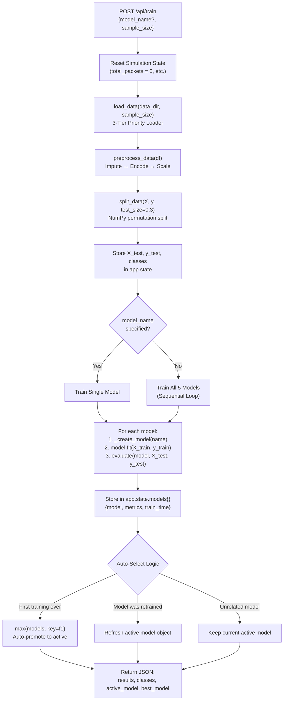

**Training Time Complexity:**

| Model | Training Complexity | Typical Time (100k samples) |
| :--- | :--- | :--- |
| Random Forest | O(n · m · T · log n) where T=50 trees | ~2-5s |
| Decision Tree | O(n · m · log n) | <1s |
| Gaussian NB | O(n · m) linear scan | <0.5s |
| XGBoost | O(n · m · T · d) where T=50, d=3 | ~3-8s |
| MLP | O(n · m · h · iter) where h=100, iter=200 | ~5-15s |

---

## Real-Time Inference Architecture

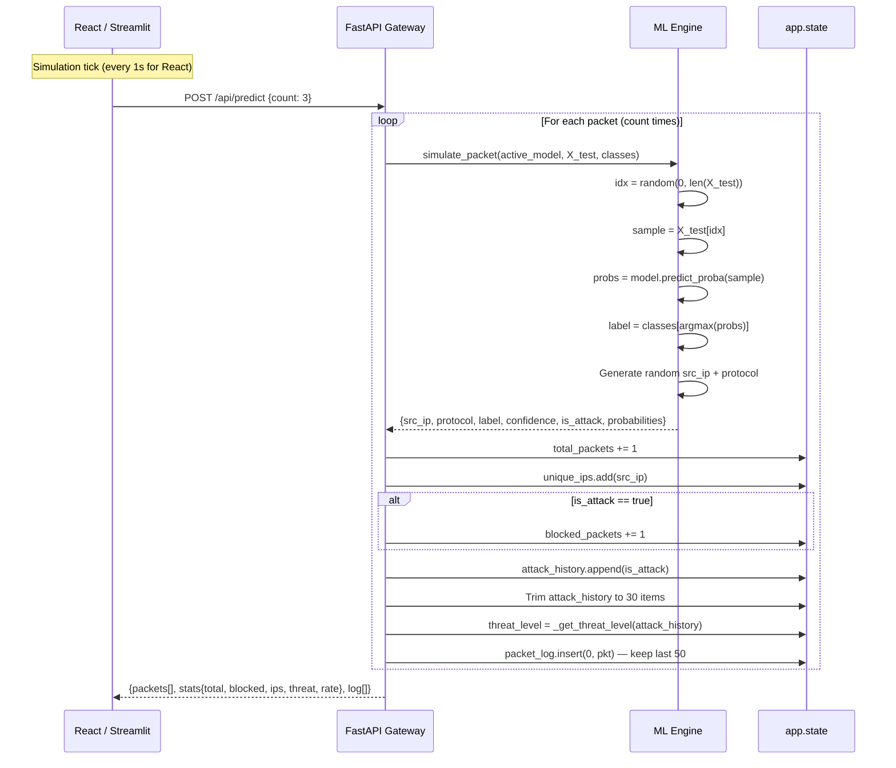

**Threat Level Algorithm:**

```python
def _get_threat_level(history):
    rate = sum(history) / len(history)  # attack_ratio over last 30 packets
    if rate > 0.20:  return "HIGH"      # >20% attacks = critical
    if rate > 0.05:  return "MODERATE"  # 5-20% attacks = elevated
    return "LOW"                         # <5% attacks = nominal
```

---

## Explainable AI (XAI) Architecture

The XAI system operates at **two levels of granularity**:

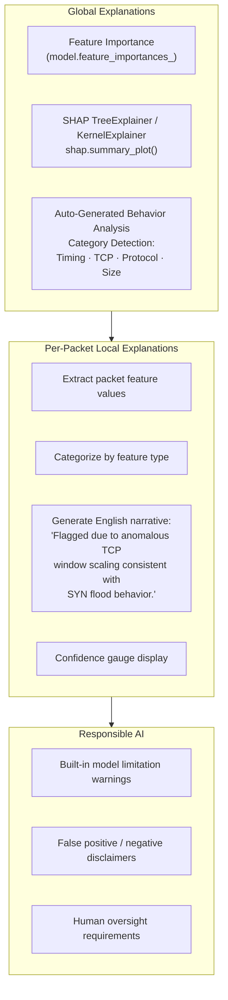

**SHAP Explainer Selection:**

| Model Type | Explainer | Why |
| :--- | :--- | :--- |
| Random Forest, Decision Tree, XGBoost | `shap.TreeExplainer` | Exact SHAP values in polynomial time for tree-based models |
| MLP, Gaussian NB | `shap.KernelExplainer` | Model-agnostic approximation (slower, uses `predict_proba` as black box) |

---

## Component Dependency Graph

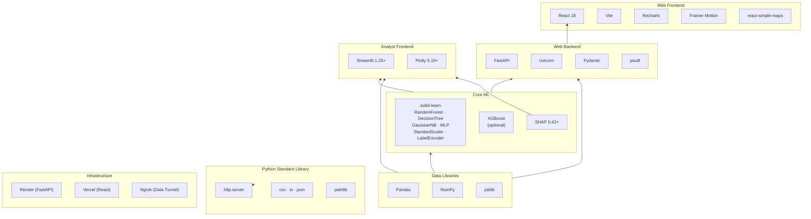

---

## Security Architecture

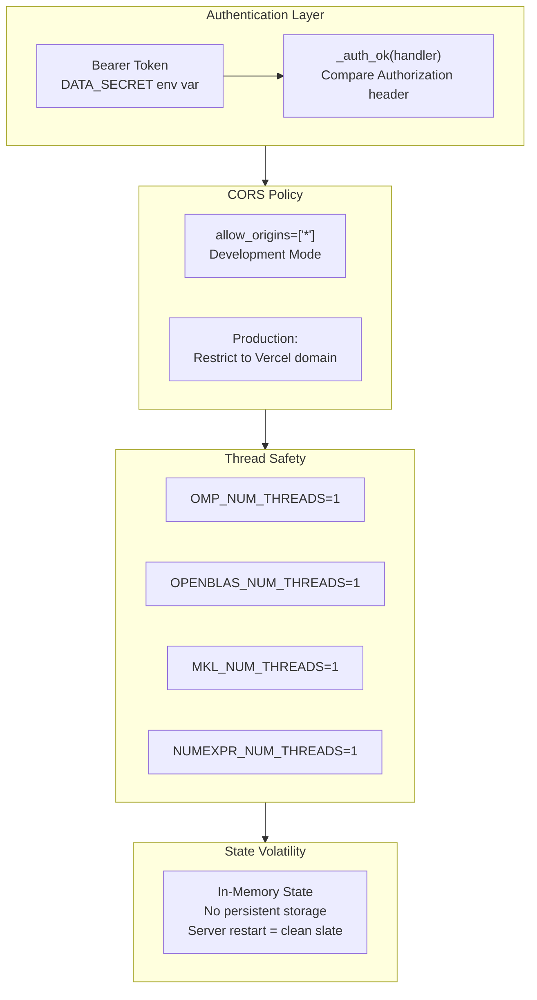

**Attack Surface Minimization:**

1. **Data Server** — Only 3 endpoints exposed; `/data` and `/info` require Bearer token
2. **FastAPI** — No authentication on API endpoints (demo/internal use); CORS wildcard must be restricted in production
3. **State** — Volatile by design; no database, no file writes during inference (only joblib saves during training in Streamlit)
4. **Dependencies** — `xgboost` is optional (`try/except ImportError`); the system gracefully degrades if not installed

---

## Deployment Architecture

```mermaid
graph TD
    subgraph DEV_MACHINE ["Developer Laptop"]
        DATA_SRV["data_server.py<br/>Port 7860"]
        CSVS["CSV Datasets<br/>10GB+"]
        CSVS --> DATA_SRV
    end

    subgraph NGROK_TUNNEL ["Ngrok Tunnel"]
        TUNNEL["HTTPS Proxy<br/>xxxx.ngrok-free.app"]
    end

    subgraph RENDER ["Render (Cloud)"]
        BACKEND["FastAPI Backend<br/>uvicorn server:app<br/>Port $PORT"]
        ENV_VARS["Environment Variables:<br/>DATA_SOURCE_URL<br/>DATA_SECRET"]
    end

    subgraph VERCEL ["Vercel (CDN)"]
        REACT_BUILD["React SPA<br/>Vite Build<br/>Static Assets"]
        VITE_ENV["VITE_API_URL →<br/>Render Backend URL"]
    end

    subgraph STREAMLIT_CLOUD ["Render / Streamlit Cloud"]
        ST_APP["Streamlit app.py<br/>Port $PORT"]
    end

    subgraph USERS ["End Users"]
        CSUITE["C-Suite / Display Screens<br/>→ React Dashboard"]
        ANALYST["SOC Analysts / Data Scientists<br/>→ Streamlit Console"]
    end

    DATA_SRV --> TUNNEL --> BACKEND
    BACKEND --> REACT_BUILD
    BACKEND -.-> ST_APP
    REACT_BUILD --> CSUITE
    ST_APP --> ANALYST
```

**Deployment Configuration per Service:**

| Service | Platform | Root Directory | Build Command | Start Command |
| :--- | :--- | :--- | :--- | :--- |
| FastAPI Backend | Render | `cyber-dashboard/backend` | `pip install -r requirements.txt` | `uvicorn server:app --host 0.0.0.0 --port $PORT` |
| React Frontend | Vercel | `cyber-dashboard` | `npm install && npm run build` | Static (CDN) |
| Streamlit Console | Render / Streamlit Cloud | `IntrusionDetectionDashboard` | `pip install -r requirements.txt` | `streamlit run app.py --server.port $PORT` |
| Data Server | Local | Repository root | — | `python data_server.py` + `ngrok http 7860` |

---

<div align="center">

**Built by [Soubhagya Jain](https://github.com/SoubhagyaJain)**

*Architecture documentation for CyberSentinel AI v3.0*

</div>
