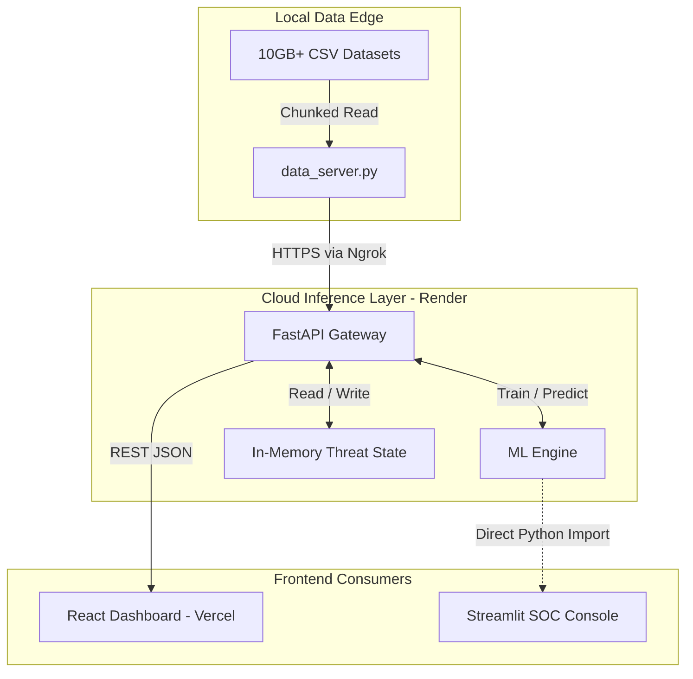
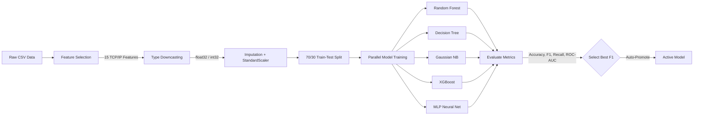
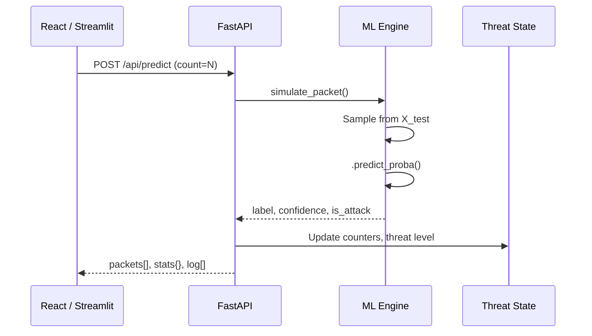

<div align="center">

# 🛡️ CyberSentinel AI

**Real-Time Network Intrusion Detection & AI-Powered SOC Dashboard**

[](https://www.python.org/)
[](https://react.dev/)
[](https://fastapi.tiangolo.com/)
[](https://streamlit.io/)
[](https://scikit-learn.org/)
[](https://xgboost.readthedocs.io/)
[](https://vitejs.dev/)
[](LICENSE)
[](#)

</div>

---

## TL;DR

* **What it is**: A full-stack, end-to-end Network Intrusion Detection System (NIDS) that trains 5 ML architectures concurrently, auto-selects the best performer, and explains every blocked packet in plain English.
* **Who it's for**: Security Analysts, Threat Hunters, SOC teams, and ML/Data Science engineers evaluating cybersecurity models.
* **Why it matters**: Traditional NIDS are black boxes. CyberSentinel pairs real-time detection with Explainable AI (XAI), so analysts see *exactly* which TCP anomaly or timing irregularity triggered an alert—not just a label.

---

## Demo


###Data set download
https://www.kaggle.com/datasets/h2020simargl/simargl2021-network-intrusion-detection-dataset?resource=download


https://drive.google.com/file/d/1gnCsBd0WMz2MyEXns71qLodzDs0Un9x0/view

---

## Why This Exists

Enterprise networks generate petabytes of traffic daily. Manual threat triage is impossible at scale. While ML models can flag anomalies, they routinely fail to explain *why* a packet was blocked, causing alert fatigue and disruptive false positives.

**CyberSentinel solves three problems simultaneously:**

| Problem | Impact | How CyberSentinel Fixes It |
| :--- | :--- | :--- |
| Black-box ML detections | Analysts can't trust or act on unexplained alerts | XAI engine generates per-packet English explanations |
| Single-model fragility | One model may overfit or miss novel attack vectors | Concurrent 5-model benchmark with dynamic F1-based auto-promotion |
| Cloud memory limits for large datasets | 10GB+ CSV datasets crash free-tier cloud platforms instantly | Local `data_server.py` streams chunked, downcast data via Ngrok tunnel |

---

## Features

### Core ML Engine

* **5 Model Architectures**: Random Forest, Decision Tree, Gaussian Naïve Bayes, XGBoost, and Multi-Layer Perceptron (MLP) — all trained and evaluated concurrently.
* **Auto-Selection**: The model with the highest **Weighted F1-Score** is automatically promoted to handle all live `/api/predict` traffic.
* **6 Evaluation Metrics**: Accuracy, Precision, Recall (critical — a missed attack is catastrophic), F1-Score, ROC-AUC, and Confusion Matrix.
* **Explainable AI (XAI)**: Feature-importance extraction + intelligent category detection (timing, TCP, protocol, size) generates human-readable narratives like *"Flagged due to anomalous TCP window scaling consistent with SYN flood behavior."*
* **Responsible AI Notices**: Built-in warnings about model limitations, false positives/negatives, and the need for human oversight.

### Data Engineering

* **3-Tier Data Loading Priority**:
  1. Local CSV files on the server filesystem (development / if files are present)
  2. Remote laptop data server via `DATA_SOURCE_URL` (cloud training on large datasets)
  3. Synthetic data generation with realistic attack distributions (60% Normal, 15% DoS, 10% DDoS, 10% Reconnaissance, 5% Theft) as a zero-config fallback.
* **15 Selected TCP/IP Feature Vectors**: `DST_TOS`, `SRC_TOS`, `TCP_WIN_SCALE_OUT`, `TCP_WIN_SCALE_IN`, `TCP_FLAGS`, `TCP_WIN_MAX_OUT`, `PROTOCOL`, `TCP_WIN_MIN_OUT`, `TCP_WIN_MIN_IN`, `TCP_WIN_MAX_IN`, `LAST_SWITCHED`, `TCP_WIN_MSS_IN`, `TOTAL_FLOWS_EXP`, `FIRST_SWITCHED`, `FLOW_DURATION_MILLISECONDS`.
* **Memory-Safe Processing**: `float64 → float32`, `int64 → int32` downcasting, `SimpleImputer` for NaN handling, `StandardScaler` normalization.
* **Global DataFrame Caching**: Prevents redundant re-downloads during sequential multi-model training runs.

### Dual Frontend Experience

* **React + Vite Dashboard** (C-Suite / Display Screens): Fast, reactive polling with TailwindCSS, Framer Motion animations, Recharts live telemetry, and `react-simple-maps` geo-visualization.
* **Streamlit SOC Console** (Analysts / Data Scientists): 841-line analytical dashboard with 5 tabs — Overview, Real-Time Ops, Model Comparison, Intelligence (XAI), and Resource Monitor.

### Security & Reliability

* **Bearer Token Authorization** on the local data server to prevent public scraping.
* **Thread-Safety Fixes**: Explicit `OMP_NUM_THREADS=1` environment locks to prevent OpenMP/BLAS deadlocks on Windows + scikit-learn.
* **Graceful Fallbacks**: No dataset? The system auto-generates synthetic data and continues operating.

---

## Architecture (High Level)

### System Architecture



### ML Training Pipeline Flowchart



### Real-Time Inference Request Lifecycle



---

## Model Architectures & Hyperparameters

| Model | Key Hyperparameters | Strengths | Latency |
| :--- | :--- | :--- | :--- |
| **Random Forest** | `n_estimators=50`, `n_jobs=-1`, `random_state=42` | High resistance to overfitting; robust feature importance | ~1–3ms per batch |
| **Decision Tree** | `criterion=gini`, `random_state=42` | Ultra-fast inference; fully transparent branching | <0.5ms |
| **Gaussian NB** | — (no tunable params) | Extremely lightweight; fast anomaly detection | <0.1ms |
| **XGBoost** | `n_estimators=50`, `learning_rate=0.1`, `max_depth=3`, `eval_metric=logloss` | Handles massive class imbalances via gradient penalization | ~1–5ms |
| **MLP** | `hidden_layer_sizes=(100,)`, `activation=relu`, `max_iter=200` | Captures nonlinear relationships across OSI layers | ~2–8ms |

### Evaluation Metrics Collected

Every model is scored against all six metrics after training:

| Metric | Why It Matters |
| :--- | :--- |
| **Accuracy** | Overall correctness of classification |
| **Precision** | Of all packets flagged as attacks, how many actually were? |
| **Recall** | Of all actual attacks, how many did the model catch? (Critical for NIDS — missed attacks are catastrophic) |
| **F1-Score (Weighted)** | Harmonic mean of Precision and Recall; the definitive ranking metric due to heavy class imbalance |
| **ROC-AUC** | Multi-class One-vs-Rest area under the curve; measures separability |
| **Confusion Matrix** | Per-class true/false positive/negative breakdown |

---

## Tech Stack

| Layer | Technology | Purpose |
| :--- | :--- | :--- |
| **ML Engine** | Scikit-Learn, XGBoost | Model training, inference, evaluation |
| **Data Processing** | Pandas, NumPy, SimpleImputer, StandardScaler | Feature engineering, imputation, normalization |
| **API Layer** | FastAPI, Uvicorn, Pydantic | Asynchronous REST endpoints with auto-generated Swagger docs |
| **React Frontend** | React 18, Vite, TailwindCSS 4 | Modern reactive dashboard with HMR |
| **Animations** | Framer Motion | Fluid DOM transitions and micro-animations |
| **Charts (React)** | Recharts, react-simple-maps | Real-time SVG charting and geo-threat visualization |
| **Analyst Frontend** | Streamlit 1.25+ | Rapid prototyping state-based Python UI |
| **Charts (Streamlit)** | Plotly 5.15+ | Interactive analytical charts, confusion matrices, ROC curves |
| **XAI** | SHAP 0.42+, Feature Importances | Game-theoretic explainability engine |
| **System Monitoring** | psutil | Live RAM/CPU usage tracking |
| **Model Persistence** | joblib | Serialized model artifact storage |
| **Infra** | Render, Vercel, Ngrok | Cloud hosting + secure local data tunneling |

---

## Project Structure

```text
CyberSentinel-AI/
│
├── IntrusionDetectionDashboard/          # Standalone Streamlit SOC UI
│   ├── app.py                            # Main 841-line analytical dashboard (5 tabs)
│   ├── config.py                         # Paths, thresholds, UI theme constants
│   ├── Dockerfile                        # Container deployment config
│   ├── requirements.txt                  # Python dependencies
│   ├── assets/                           # Custom CSS styles
│   ├── models/                           # Serialized .joblib model artifacts (50+ files)
│   ├── logs/                             # Structured application logs
│   └── utils/                            # Modular helper library
│       ├── preprocessing.py              # Data loading, cleaning, feature engineering
│       ├── training.py                   # Model instantiation and fitting
│       ├── evaluation.py                 # Metrics computation, confusion matrix, ROC curves
│       ├── explainability.py             # SHAP value computation and summary plots
│       ├── model_io.py                   # joblib save/load/list operations
│       └── logger.py                     # Structured logging setup
│
├── cyber-dashboard/                      # React + FastAPI full-stack application
│   ├── src/                              # React component tree
│   │   ├── App.jsx                       # Root application with tab routing
│   │   ├── api.js                        # FastAPI endpoint client wrapper
│   │   ├── index.css                     # Global styles and design tokens
│   │   ├── main.jsx                      # React DOM entry point
│   │   └── components/                   # 14 reusable UI components
│   ├── index.html                        # SPA entry point
│   ├── vite.config.js                    # Vite build configuration
│   ├── package.json                      # Node.js dependencies and scripts
│   └── backend/                          # Python REST inference engine
│       ├── server.py                     # FastAPI app, routes, in-memory state (345 lines)
│       ├── requirements.txt              # Backend Python dependencies
│       └── ml/                           # Core ML logic
│           ├── data.py                   # 3-tier data loading, preprocessing, caching
│           └── engine.py                 # Model creation, training, evaluation, simulation
│
├── data_server.py                        # Local HTTP streaming server for large CSVs
├── train_model.py                        # Standalone CLI model trainer
├── .gitignore                            # Git exclusion rules
└── README.md                             # This file
```

---

## Quickstart

You can have the entire system running locally in under 5 minutes.

```bash
# Clone the repository
git clone https://github.com/SoubhagyaJain/CyberSentinel-AI.git
cd CyberSentinel-AI
```

**Option A — Full Stack (React + FastAPI)**
```bash
# Terminal 1: Backend
cd cyber-dashboard/backend
python -m venv venv && source venv/bin/activate  # Windows: venv\Scripts\activate
pip install -r requirements.txt
uvicorn server:app --host 0.0.0.0 --port 8000 --reload

# Terminal 2: Frontend
cd cyber-dashboard
npm install
echo "VITE_API_URL=http://localhost:8000" > .env.development
npm run dev
```

**Option B — Streamlit SOC Console (standalone)**
```bash
cd IntrusionDetectionDashboard
python -m venv .venv && source .venv/bin/activate
pip install -r requirements.txt
streamlit run app.py
```

> **Note**: If no `dataset-partX.csv` files are present, the system automatically generates synthetic data with realistic attack distributions and continues operating.

---

## Installation

### Requirements

* Python `3.10+`
* Node.js `18+` (only for React frontend)
* 8GB+ RAM recommended (16GB for full 500k sample training)

### Backend Setup

```bash
cd cyber-dashboard/backend
python -m venv venv
source venv/bin/activate  # Windows: venv\Scripts\activate
pip install -r requirements.txt
```

### React Frontend Setup

```bash
cd cyber-dashboard
npm install
echo "VITE_API_URL=http://localhost:8000" > .env.development
```

### Streamlit Setup

```bash
cd IntrusionDetectionDashboard
python -m venv .venv
source .venv/bin/activate
pip install -r requirements.txt
```

---

## Configuration

| Variable | Where | Description | Default |
| :--- | :--- | :--- | :--- |
| `DATA_SOURCE_URL` | Backend env | Ngrok URL pointing to your local `data_server.py` | *(none)* |
| `DATA_SECRET` | Backend env + `data_server.py` | Bearer token for data stream authentication | `cybersentinel-local-2024` |
| `VITE_API_URL` | React `.env` | Base URL for the FastAPI backend | `http://localhost:8000` |
| `SAMPLE_SIZE` | `config.py` | Default sample size for interactive training | `100000` |
| `MAX_SAMPLE_SIZE` | `config.py` | Maximum allowed sample size in web interface | `500000` |
| `SHAP_SAMPLE_SIZE` | `config.py` | Number of samples for SHAP computation (expensive) | `100` |
| `RAM_WARNING_THRESHOLD` | `config.py` | RAM usage percentage to trigger UI warning | `80` |
| `TEST_SIZE` | `config.py` | Train/test split ratio | `0.3` |
| `RANDOM_STATE` | `config.py` / `engine.py` | Seed for reproducibility across all models | `42` |

---

## Usage

### Start the Local Data Server

Run from the repository root (only needed if you have the large CSV datasets):
```bash
python data_server.py
# Optionally expose to the internet:
ngrok http 7860
```

### Start the FastAPI Backend

Run from `cyber-dashboard/backend`:
```bash
uvicorn server:app --host 0.0.0.0 --port 8000 --reload
```
API Documentation: `http://localhost:8000/docs`

### Start the React Dashboard

Run from `cyber-dashboard`:
```bash
npm run dev
```
Dashboard live at `http://localhost:5173`

### Train Models via API

```bash
# Train all 5 models with 100k samples
curl -X POST http://localhost:8000/api/train \
  -H "Content-Type: application/json" \
  -d '{"sample_size": 100000}'

# Train a specific model
curl -X POST http://localhost:8000/api/train \
  -H "Content-Type: application/json" \
  -d '{"model_name": "XGBoost", "sample_size": 100000}'
```

### Run Predictions

```bash
# Simulate 10 packet predictions
curl -X POST http://localhost:8000/api/predict \
  -H "Content-Type: application/json" \
  -d '{"count": 10}'
```

### Switch Active Model

```bash
curl -X POST http://localhost:8000/api/set-active/XGBoost
```

---

## API Reference

| Method | Endpoint | Description |
| :--- | :--- | :--- |
| `GET` | `/api/health` | Liveness probe. Returns status and loaded model count. |
| `POST` | `/api/train` | Trains one or all models. Body: `{ model_name?, sample_size }`. |
| `GET` | `/api/models` | Returns model registry with metrics, feature importance, and active model. |
| `POST` | `/api/set-active/{model_name}` | Overrides the auto-selected active model. Resets simulation. |
| `POST` | `/api/predict` | Simulates N packet predictions through the active model. Body: `{ count }`. |
| `GET` | `/api/dashboard` | Aggregated stats: packets, blocked, threat level, attack distribution, model info. |
| `GET` | `/api/system` | Live system metrics: RAM %, CPU %, used/total GB. |
| `POST` | `/api/simulation/reset` | Resets all simulation counters and threat state. |
| `POST` | `/api/models/reset` | Clears all trained models and resets to blank state. |

---

## Streamlit Dashboard Tabs

The Streamlit SOC Console (`app.py`, 841 lines) provides 5 operational tabs:

| Tab | Purpose |
| :--- | :--- |
| **📊 Overview** | Traffic class distribution (pie chart), dataset preview, active model performance snapshot (accuracy, F1, ROC-AUC, train time). |
| **🚨 Real-Time Ops** | Live packet stream with color-coded severity (`⛔ Attack` / `✅ Normal`), start/stop/reset simulation controls, threat level indicator, session metrics. |
| **📈 Model Comparison** | Side-by-side performance summary table with highlighted best scores. Bar charts for Accuracy, F1, ROC-AUC, and Training Time. Per-model confusion matrix viewer. |
| **🧠 Intelligence (XAI)** | Global feature importance chart, auto-generated model behavior analysis, per-packet local explanations with reasoning strings and confidence gauges, responsible AI warnings. |
| **🖥️ Resources** | Live RAM usage gauge with progress bar, CPU utilization monitor. |

---

## Deployment

### FastAPI Backend → Render

1. Connect your repository. Root directory: `cyber-dashboard/backend`.
2. Build command: `pip install -r requirements.txt`
3. Start command: `uvicorn server:app --host 0.0.0.0 --port $PORT`
4. Set environment variables: `DATA_SOURCE_URL`, `DATA_SECRET`.

### React Frontend → Vercel

1. Connect your repository. Framework: Vite. Root directory: `cyber-dashboard`.
2. Set environment variable: `VITE_API_URL` → your Render backend URL.

### Streamlit → Render / Streamlit Cloud

1. Root directory: `IntrusionDetectionDashboard`.
2. Start command: `streamlit run app.py --server.port $PORT`

### Local Data Edge (Large Datasets)

1. Place `dataset-partX.csv` files in the repo root.
2. Run `python data_server.py` on your laptop.
3. Expose: `ngrok http 7860`. Copy the HTTPS URL to your Render `DATA_SOURCE_URL` env var.

---

## Security

* **Data Authorization**: `data_server.py` validates a `Bearer` token on every request. Always change the default `DATA_SECRET` before exposing via Ngrok.
* **CORS**: The FastAPI backend uses `allow_origins=["*"]` for development convenience. Restrict this to your Vercel domain in production.
* **State Volatility**: Threat state is held in-memory via `app.state`. It is fast but volatile — a server restart clears all simulation data. This is by design for a demo system.
* **Thread Safety**: Explicit `OMP_NUM_THREADS=1` / `OPENBLAS_NUM_THREADS=1` environment locks are set at import time to prevent OpenMP deadlocks on Windows with scikit-learn.

---

## Troubleshooting

| Issue | Cause | Fix |
| :--- | :--- | :--- |
| `MemoryError` during training | Sample size too large for available RAM | Reduce `sample_size` to `10000`–`50000`. Ensure downcasting is active in `ml/data.py`. |
| API returns 500 on `/api/train` | Data server unreachable or no local CSVs | Ensure `data_server.py` is running + Ngrok is active + `DATA_SOURCE_URL` is correct. The system will fallback to synthetic data if all else fails. |
| Streamlit shows "Model Offline" | No model has been trained yet | Click **⚡ TRAIN ALL MODELS** in the sidebar. |
| React Dashboard shows no data | `VITE_API_URL` misconfigured | Verify the URL matches the running FastAPI instance exactly (no trailing slash). |
| XGBoost model fails to train | `xgboost` package not installed | Run `pip install xgboost`. The system gracefully skips XGBoost if the import fails. |
| SHAP computation is extremely slow | SHAP is computationally expensive | `SHAP_SAMPLE_SIZE` defaults to 100 in `config.py`. Reduce further if needed. |
| scikit-learn hangs on Windows | OpenMP thread deadlock | Already mitigated — `OMP_NUM_THREADS=1` is set at the top of `server.py` and `data.py`. |

---

## Roadmap

* [ ] Real-time PCAP sniffing via `pyshark` / `scapy` to replace CSV-based simulation.
* [ ] Deep sequence models (LSTMs / Transformers) for multi-packet temporal attack detection (Slowloris, low-and-slow probes).
* [ ] PostgreSQL for persistent threat logs + Redis for high-speed rate limiting.
* [ ] Apache Kafka / Celery message queues to decouple ML inference from the API thread.
* [ ] JWT-based Role-Based Access Control (RBAC) — Analyst vs. Admin views.
* [ ] PySpark / Dask distributed training on the full 50GB+ dataset across a cluster.
* [ ] GitHub Actions CI/CD with automated `pytest` and linting.

---

## Contributing

1. Fork the repository.
2. Create a feature branch: `git checkout -b feature/your-feature`
3. Commit your changes: `git commit -m 'feat: add your feature'`
4. Push to the branch: `git push origin feature/your-feature`
5. Open a Pull Request.

Please open an issue before submitting large architectural changes.

---

## License

Distributed under the MIT License. See `LICENSE` for more information.

---

## Assumptions & TODOs

- [x] Dataset files (`dataset-partX.csv`) are manually placed in the root directory.
- [x] Synthetic fallback data is auto-generated if no datasets are available.
- [ ] TODO: Add automated `pytest` test suites for the FastAPI backend.
- [ ] TODO: Add Cypress / Jest tests for the React frontend.
- [ ] TODO: Add GitHub Actions CI/CD pipeline.
- [ ] TODO: Replace demo placeholder with actual GIFs/screenshots.
- [ ] TODO: Restrict CORS origins for production deployment.

---

<div align="center">

**Built by [Soubhagya Jain](https://github.com/SoubhagyaJain)**

*Securing the zero-trust network layer, one packet vector at a time.*

</div>
