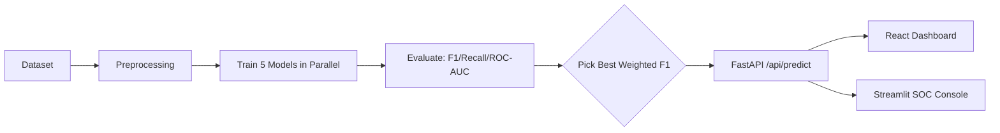

<div align="center">

# 🛡️ CyberSentinel AI  
**Real-Time Network Intrusion Detection + Explainable SOC Dashboard**

[](https://www.python.org/)
[](https://fastapi.tiangolo.com/)
[](https://react.dev/)
[](https://streamlit.io/)
[](https://scikit-learn.org/)
[](https://xgboost.readthedocs.io/)
[](LICENSE)

**Live Demo (React Dashboard):** https://cyber-sentinel-ai-ten.vercel.app/

</div>

---

## 🚀 TL;DR (Recruiter-Friendly)

CyberSentinel AI is an **end-to-end, production-style Network Intrusion Detection System (NIDS)**:

- ✅ Trains **5 models in parallel** (Random Forest / Decision Tree / Gaussian NB / XGBoost / MLP)
- ✅ Auto-selects the **best model by Weighted F1** and routes live traffic to it
- ✅ Serves inference via **FastAPI** (`/api/predict`) with validation + error handling
- ✅ Ships two UIs:
  - **React Dashboard** (executive-level telemetry + live threat state)
  - **Streamlit SOC Console** (metrics, confusion matrices, ROC-AUC, model comparisons)
- ✅ Adds **Explainable AI (XAI)** so analysts see *why* a packet was flagged

**Why this matters:** most ML security projects stop at training notebooks. This one is a **system**: ingestion → training → selection → serving → monitoring-style telemetry. 🧠⚙️

---

## 📸 Demo (UI)

> Tip: keep 1–2 hero screenshots in the README. Move the rest to `/docs/screenshots` so the page stays fast.


---

## 🧠 What’s Different (vs typical NIDS demos)

| Problem with typical demos | What CyberSentinel does instead |
|---|---|
| “One notebook, one model” | **Multi-model benchmark** + **auto-promotion** |
| Only accuracy | Uses **Weighted F1, Recall, ROC-AUC**, confusion matrices |
| Black-box predictions | **XAI** + “why flagged” explanations |
| No system thinking | API + UI + consistent data flow + deployment-ready layout |

---


---

## 📊 Resume-Grade Metrics (Proof)

These are **real numbers from the running dashboard demo** (Model Comparison screen) + the **latency tradeoffs** documented in the system design.

### Model Benchmark (from Dashboard “Model Comparison”)

| Model | F1 (Weighted) | Accuracy | Precision | Train Time |
|---|---:|---:|---:|---:|
| **Random Forest** | **71.2%** | 73.7% | 71.3% | 3.60s |
| **XGBoost** | 68.5% | **75.1%** | 71.3% | 1.21s |
| **MLP** | 70.6% | 71.2% | 70.6% | 28.52s |
| **Gaussian NB** | 67.7% | 72.3% | 70.6% | **0.05s** |
| **Decision Tree** | 70.7% | 70.5% | 70.8% | 0.46s |

✅ Why this is strong: you’re not hiding behind one accuracy number — you show **multi-model benchmarking + speed tradeoffs**, which is what real SOC / production teams care about.

### Inference Latency Tradeoffs (from System Notes)

| Model | Inference Latency (Approx.) | When it’s useful |
|---|---:|---|
| **Random Forest** | ~1–3ms / batch | Best overall balance (strong Weighted F1 + explainable importance) |
| **Decision Tree** | <0.5ms | Ultra-fast “always-on” baseline |
| **Gaussian NB** | <0.1ms | Fastest lightweight detector / fallback |

🧠 **Auto-Promotion Logic:** the system automatically selects the best model using **Weighted F1** and routes `/api/predict` traffic to it (while still letting you override the active model).  

---

## ✨ Features

### Core ML Engine
- **5 model architectures** trained/evaluated together.
- **Auto-selection**: best **Weighted F1** becomes the live model for `/api/predict`.
- **Metrics**: Accuracy, Precision, Recall, F1, ROC-AUC, Confusion Matrix.
- **XAI**: feature importance + category grouping (timing/TCP/protocol/size) → human-readable explanations.
- **Responsible AI notices**: highlights false positives/negatives and encourages human oversight.

### Data Engineering (Handles “too big for free-tier cloud”)
- **3-tier data loading priority**:
  1) Local CSV files (if present)  
  2) Remote laptop data server via `DATA_SOURCE_URL` (use Ngrok for secure tunneling)  
  3) Synthetic fallback dataset (zero-config demo mode)
- **Memory-safe processing**: downcasting (`float64→float32`, `int64→int32`), imputation, scaling.
- **Global DataFrame caching** to avoid re-downloading between model runs.

### Dual Frontend Experience
- **React + Vite Dashboard (Vercel)**: “NOC screen” style telemetry + threat state.
- **Streamlit SOC Console**: analyst view with deep evaluation + XAI + resource monitoring.

---

## 🧩 Architecture (High Level)

**Flow:** Dataset → Preprocess → Train 5 models → Evaluate → Auto-select best → Serve via FastAPI → Dashboard + SOC UI



📌 Want the full deep-dive (layers, topology, deployment diagrams)?  
See: **[`docs/ARCHITECTURE.md`](docs/ARCHITECTURE.md)**

---

## 🗂️ Repo Structure (Current)

```text
CyberSentinel-AI/
│
├── IntrusionDetectionDashboard/          # Streamlit SOC UI
│   ├── app.py                            # 5-tab analytical console
│   ├── config.py                         # thresholds + constants
│   ├── requirements.txt
│   └── utils/                            # preprocessing, training, eval, XAI, model IO
│
├── cyber-dashboard/                      # React + FastAPI full-stack app
│   ├── src/                              # React component tree
│   ├── backend/                          # FastAPI + ML engine
│   │   ├── server.py                     # API + in-memory threat state
│   │   └── ml/                           # data loading + training + simulation
│   └── package.json
│
├── data_server.py                        # Local HTTP streaming server for large CSVs
├── train_model.py                        # Standalone CLI model trainer
└── README.md
```

---

## ⚡ Quickstart (Local)

### 1) Clone
```bash
git clone https://github.com/SoubhagyaJain/CyberSentinel-AI.git
cd CyberSentinel-AI
```

### Option A — Full Stack (React + FastAPI)
**Terminal 1: Backend**
```bash
cd cyber-dashboard/backend
python -m venv venv
# Windows: venv\Scripts\activate
# Mac/Linux:
source venv/bin/activate

pip install -r requirements.txt
uvicorn server:app --host 0.0.0.0 --port 8000 --reload
```

**Terminal 2: Frontend**
```bash
cd cyber-dashboard
npm install
echo "VITE_API_URL=http://localhost:8000" > .env.development
npm run dev
```

Open: http://localhost:5173

### Option B — Streamlit SOC Console
```bash
cd IntrusionDetectionDashboard
python -m venv venv
source venv/bin/activate  # Windows: venv\Scripts\activate
pip install -r requirements.txt
streamlit run app.py
```

---

## 🧪 API Usage

### Health
```bash
curl http://localhost:8000/health
```

### Predict (example)
```bash
curl -X POST http://localhost:8000/api/predict \
  -H "Content-Type: application/json" \
  -d '{"features": {"DST_TOS": 0, "SRC_TOS": 0, "TCP_WIN_SCALE_OUT": 2, "FLOW_DURATION_MILLISECONDS": 42}}'
```

> If you change feature names or schema, update the example JSON to match your FastAPI/Pydantic model.

---

## 📥 Dataset (Don’t commit it to GitHub)

- SIMARGL 2021 (Kaggle): https://www.kaggle.com/datasets/h2020simargl/simargl2021-network-intrusion-detection-dataset

### Big dataset strategy (what you implemented)
If you’re using cloud free tiers and the dataset is huge (10GB+), run your **local data server** and stream it in:

1) Start local server:
```bash
python data_server.py
```

2) Expose via Ngrok:
```bash
ngrok http 7860
```

3) Set environment variables for the backend (Render/local):
- `DATA_SOURCE_URL` = your ngrok URL  
- `DATA_SECRET` = a bearer token (to protect `/data` and `/info`)

---

## 🚢 Deployment (Vercel + Render)

- **React dashboard** → Vercel (`cyber-dashboard/`)
  - Env: `VITE_API_URL` = Render backend URL
- **FastAPI backend** → Render (`cyber-dashboard/backend/`)
  - Env: `DATA_SOURCE_URL`, `DATA_SECRET` (if using remote dataset streaming)
- **Streamlit console** → Render/Streamlit Cloud (`IntrusionDetectionDashboard/`)

(Full diagrams + commands in `docs/ARCHITECTURE.md`.)

---

## 🛣️ Roadmap
- [ ] Add measured p50/p95 latency benchmarks + load testing script
- [ ] Add unit tests for preprocessing + contract tests for API
- [ ] Add CI (lint + tests on PR)
- [ ] Add persistent threat logs (Postgres) + fast state cache (Redis)
- [ ] Replace CSV simulation with live PCAP sniffing (`scapy`/`pyshark`)

---

## 🤝 Contributing
1. Fork the repository  
2. Create a feature branch: `git checkout -b feature/your-feature`  
3. Commit: `git commit -m "feat: add your feature"`  
4. Push and open a PR  

---

## 📄 License
MIT — see `LICENSE`.

---

<div align="center">

Built by **Soubhagya Jain**  
</div>
